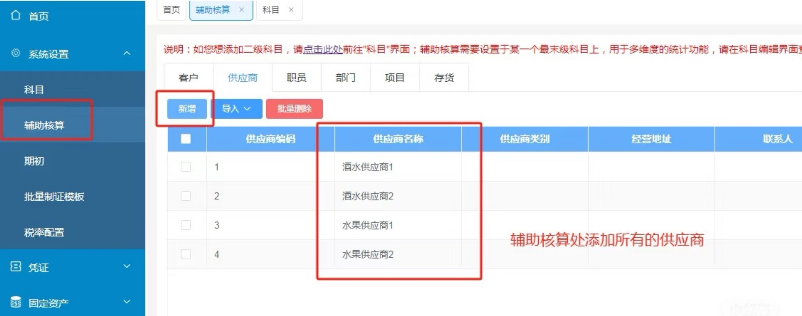

Auxiliary Accounting is a powerful tool that attaches "tags" or "dimensions" to a general ledger account, allowing for detailed tracking beyond the main account balance. For the "Accounts Receivable" account, its primary use is to link the "Customer" auxiliary dimension.

::: greybox  
1120 Accounts Receivable
1120.001 Accounts Receivable - Customer A
1120.002 Accounts Receivable - Customer B
1120.003 Accounts Receivable - Customer C
... (This list becomes unmanageable with hundreds of customers.)
This causes your chart of accounts to become bloated, inefficient, and difficult to maintain. 
:::

::: bad
Figure: Bad Example - Problem with the Traditional Method  
:::

::: greybox 
The Auxiliary Accounting Solution:

Setup: Use one main account (1120 Accounts Receivable) and enable the "Customer" dimension for it.

Entry: When posting an invoice to this account, the system prompts you to select a specific customer.

Result: Each transaction is automatically tagged (e.g., 1120 Receivable | Customer A).
:::

:::class

:::

::: good
Figure: Good Example - The Auxiliary Accounting Solution  
:::

### The Outcome:
Your financial data is instantly transformed. Instead of being a single, lump-sum figure, your Accounts Receivable becomes a collection of detailed, multi-dimensional records (Account + Customer). This allows you to see both the total money owed to you and the exact breakdown

#### Key Benefits
1. Clear Customer Ledgers:
   - You can instantly generate a transaction history and a current balance for any specific customer (including all sales, payments, and credit memos). This directly addresses your need to "clearly see how much a specific customer still owes at the end of any given month."
2. Automatic Generation of Critical Reports
   - The system can automatically generate an Aged Receivables Report based on the auxiliary accounting data. This report is vital for cash flow management and bad debt assessment, as it shows how long each invoice (for each customer) has been outstanding (e.g., Current, 1-30 days, 31-60 days, 61-90 days, 90+ days).
3. Improved Data Accuracy
   - Selecting customers from a standardized list during data entry eliminates spelling errors, inconsistencies, and duplicates, ensuring data integrity and reliable reporting.

#### Important Considerations (Especially for Year-End)
1. Mandatory Year-End (and Month-End) Reconciliation
   - This is the most crucial check. Before closing your books at month-end or year-end, you MUST perform this reconciliation:
     1. The total balance of the "1120 Accounts Receivable" account (from the General Ledger).
     2. The sum of all individual customer balances (from the Auxiliary Receivables Ledger / Customer Ledger).
     3. These two amounts MUST be equal. A discrepancy indicates a data entry error, such as a transaction posted to the main account without specifying a customer, or assigned to an incorrect customer. This discrepancy must be investigated and resolved before closing the period.

Implementing the "Customer" auxiliary dimension for your Accounts Receivable is a fundamental step towards precise financial management. It empowers you to track exactly who owes you what, while keeping your general ledger streamlined. By making the "General Ledger Balance = Sum of All Customer Balances" reconciliation a non-negotiable part of your closing procedure, you ensure the integrity and reliability of your financial data.
